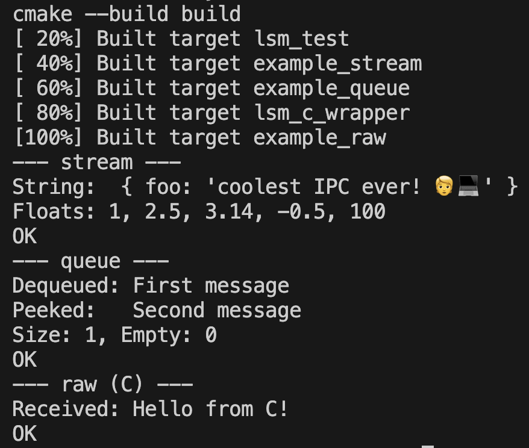

# `libsharedmemory`

`libsharedmemory` is a small C++11 header-only library for using shared memory on Windows, Linux and macOS. `libsharedmemory` makes it easy to transfer data between isolated host OS processes. It also helps inter-connecting modules of applications that are implemented in different programming languages. It allows for simple read/write data transfer of `uint8_t*` / `unsigned char*` and `std::string`.



## Example

```cpp

std::string dataToTransfer = "{ foo: 'coolest IPC ever! 🧑‍💻' }";

// the name of the shared memory is os-wide announced
// the size is in bytes and must be big enough to handle the data (up to 4GiB)
// if persistency is disabled, the shared memory segment will
// be garbage collected when the process that wrote it is killed
SharedMemoryWriteStream write$ {/*name*/ "jsonPipe", /*size*/ 65535, /*persistent*/ true};
SharedMemoryReadStream read$ {/*name*/ "jsonPipe", /*size*/ 65535, /*persistent*/ true};

// writing the string to the shared memory
write$.write(dataToTransfer);

// reading the string from shared memory
// you can run this in another process, thread,
// even in another app written in another programming language
std::string dataString = read$.read();

std::cout << "UTF8 string written and read" << dataString << std::endl;
```

## Source code package management via `npm`

In case you want to use this library in your codebase,
you could just copy & paste the `include/libsharedmemory/libsharedmemory.hpp` into your `include` or `deps` directory. But then you'd have to manually manage the code base.

However, you could also use `npm` for a smarter dependency management approach.
Therefore, install [Node.js](https://www.nodejs.org) which comes bundled with `npm`, the Node package manager.

Now run `npm init` in your project root directoy.
After initial setup, run `npm install cpp_libsharedmemory` and add `node_modules/cpp_libsharedmemory/include/libsharedmemory` to your include path.

Whenever this library updates, you can also update your dependencies via
`npm upgrade`. Futhermore, people who audit the code can announce security 
reports that are announced when running `npm audit`. Finally, it's also much
easier for you to install all project dependencies by just running `npm install`
in your projects root directory. Managing third party code becomes obsolete at all. 

## Limits

`libsharedmemory` does only support the following datatypes (array-like):
- `std::string`
- `float*`
- to be continued

Single value access via `.data()[index]` API:
- all data types C++ supports

There is no explicit handling of endinanness. Memory interpretation 
issues may happen when transferring the memory between different machines/vm.

Although the binary memory layout should give you no headache
when compiling/linking using different compilers, 
the behavior is undefined.

On Windows: Atm no support for shared memory persistency after the process 
that writes the memory quits.

## Memory layout

When writing data into a named shared memory segment, `libsharedmemory`
does write 5 bytes of meta information:

- `flags` (`char`) is a bitmask that indicates data change (via an odd/even bit flip) as well as the data type transferred (1 byte)
- `size` (`std::size_t`) indicates the buffer size in bytes (4 bytes)

Therefore the binary memory layout is:
`|flags|size|data|`

The following datatype flags are defined:
```c
enum DataType {
  kMemoryChanged = 1,
  kMemoryTypeString = 2,
  kMemoryTypeFloat = 4,
};
```

`kMemoryChanged` is the change indicator bit. It will flip odd/evenly
to indicate data change. Continuous data reader will thus be able 
to catch every data change. 

## Build

This project is meant to be built with `cmake` and `clang`.
However, it _should_ also build with MSVC and GCC.

```sh
./build.sh
```

## Test

Test executables are built automatically and can be executed
to verify the correct function of the implementation on your machine:

```sh
./test.sh
```

## License

`libsharedmemory` is released under the MIT license, see the `LICENSE` file.

## Roadmap

1) Support for `float32*`, `float64*`, vector data types (without the vector container, `vec.data()`)
2) Windows shared memory persistency support
3) Multi-threaded non-blocking `onChange( lambda fn )` data change handler on the read stream