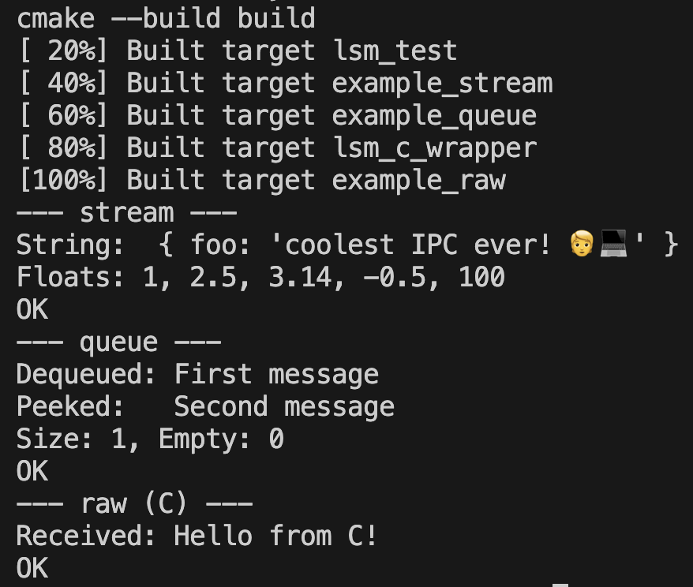

# `libsharedmemory`

`libsharedmemory` is a small C++20 header-only library for using shared memory on Windows, Linux and macOS. `libsharedmemory` makes it easy to transfer data between isolated host OS processes. It also helps inter-connecting modules of applications that are implemented in different programming languages. It supports:

- Simple read/write data transfer using single, indexed memory address access
- Array-types like `std::string`, `float*`, `double*`
- Message queue functionality with `SharedMemoryQueue` for FIFO communication



## Example

```cpp

std::string dataToTransfer = "{ foo: 'coolest IPC ever! 🧑‍💻' }";

// the name of the shared memory is os-wide announced
// the size is in bytes and must be big enough to handle the data (up to 4GiB)
// if persistency is disabled, the shared memory segment will
// be garbage collected when the process that wrote it is killed
SharedMemoryWriteStream write$ {/*name*/ "jsonPipe", /*size*/ 65535, /*persistent*/ true};
SharedMemoryReadStream read$ {/*name*/ "jsonPipe", /*size*/ 65535, /*persistent*/ true};

// writing the string to the shared memory
write$.write(dataToTransfer);

// reading the string from shared memory
// you can run this in another process, thread,
// even in another app written in another programming language
std::string dataString = read$.readString();

std::cout << "UTF8 string written and read" << dataString << std::endl;
```

### Message Queue Example

```cpp
// Create a message queue with capacity for 10 messages, max 256 bytes each
SharedMemoryQueue writer{"messageQueue", /*capacity*/ 10, /*maxMessageSize*/ 256, /*persistent*/ true, /*isWriter*/ true};
SharedMemoryQueue reader{"messageQueue", /*capacity*/ 10, /*maxMessageSize*/ 256, /*persistent*/ true, /*isWriter*/ false};

// Enqueue messages from writer
writer.enqueue("First message");
writer.enqueue("Second message");

// Dequeue messages from reader
std::string msg;
if (reader.dequeue(msg)) {
    std::cout << "Received: " << msg << std::endl;
}

// Peek at next message without removing it
if (reader.peek(msg)) {
    std::cout << "Next message: " << msg << std::endl;
}

// Check queue status
std::cout << "Queue size: " << reader.size() << std::endl;
std::cout << "Is empty: " << reader.isEmpty() << std::endl;
std::cout << "Is full: " << reader.isFull() << std::endl;
```

## Source code package management via `npm`

In case you want to use this library in your codebase,
you could just copy & paste the `include/libsharedmemory/libsharedmemory.hpp` into your `include` or `deps` directory. But then you'd have to manually manage the code base.

However, you could also use `npm` for a smarter dependency management approach.
Therefore, install [Node.js](https://www.nodejs.org) which comes bundled with `npm`, the Node package manager.

Now run `npm init` in your project root directoy.
After initial setup, run `npm install cpp_libsharedmemory` and add `node_modules/cpp_libsharedmemory/include/libsharedmemory` to your include path.

Whenever this library updates, you can also update your dependencies via
`npm upgrade`. Futhermore, people who audit the code can announce security 
reports that are announced when running `npm audit`. Finally, it's also much
easier for you to install all project dependencies by just running `npm install`
in your projects root directory. Managing third party code becomes obsolete at all. 

## Features

### Stream-based Transfer
`libsharedmemory` supports the following datatypes for stream-based transfer:
- `std::string` (UTF-8 compatible)
- `float*` (arrays of floats)
- `double*` (arrays of doubles)

Single value access via `.data()[index]` API:
- all scalar datatypes supported in C/C++

### Message Queue
`SharedMemoryQueue` provides FIFO message queue functionality:
- Thread-safe enqueue/dequeue operations
- Configurable capacity and maximum message size
- Peek functionality to inspect messages without removing them
- Suitable for single producer, single consumer or single producer, multiple consumers patterns

## Limits

- This library doesn't care for endianness. This should be naturally fine
because shared memory shouldn't be shared between different machine 
architectures. However, if you plan to copy the shared buffer onto a 
network layer protocol, make sure to add an endianness indication bit.

- Although the binary memory layout should give you no headache
when compiling/linking using different compilers, 
the behavior is undefined.

- **SharedMemoryQueue** currently works best for single producer, single consumer 
or single producer, multiple consumers scenarios. Multiple concurrent producers 
require additional external synchronization.

## Memory layout

When writing data into a named shared memory segment, `libsharedmemory`
does write 5 bytes of meta information:

- `flags` (`char`) is a bitmask that indicates data change (via an odd/even bit flip) as well as the data type transferred (1 byte)
- `size` (`int`) indicates the buffer size in bytes (4 bytes)

Therefore the binary memory layout is:
`|flags|size|data|`

The following datatype flags are defined:
```c
enum DataType {
  kMemoryChanged = 1,
  kMemoryTypeString = 2,
  kMemoryTypeFloat = 4,
  kMemoryTypeDouble = 8,
};
```

`kMemoryChanged` is the change indicator bit. It will flip odd/evenly
to indicate data change. Continuous data reader will thus be able 
to catch every data change. 

## License

`libsharedmemory` is released under the MIT license, see the `LICENSE` file.

## Roadmap

1) Multi-threaded non-blocking `onChange( lambda fn )` data change handler on the read stream
2) Support for multiple concurrent producers in SharedMemoryQueue with lock-free atomic operations
