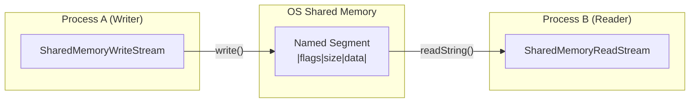
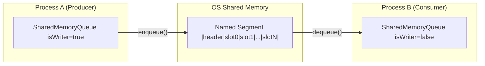
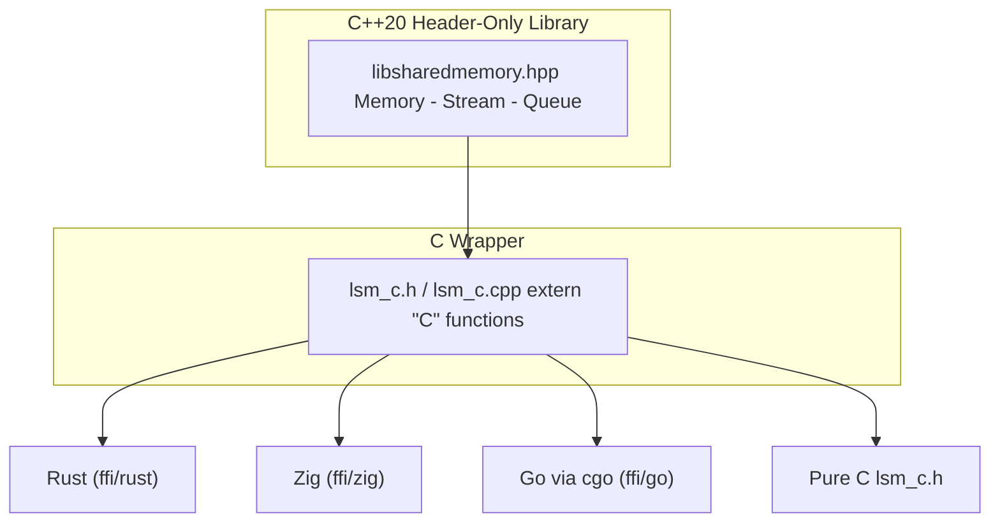
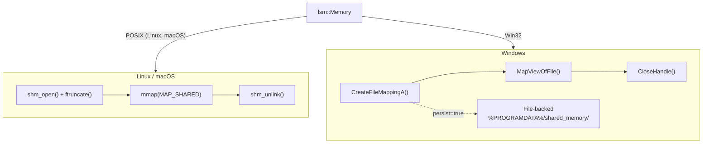

# libsharedmemory

A lightweight, header-only C++20 library for inter-process communication via shared memory. Transfer data between isolated OS processes - or between modules written in different programming languages - with a simple, cross-platform API.

**Important:** v2.0.0 introduces a wire-layout breaking change for stream and queue metadata. Existing processes built against the old in-memory format must not interoperate with this new build until all participants are updated together.

**v1.10.0 is the most stable v1 release and is recommended if you need strict compatibility with existing v1 participants.**


**Key capabilities:**
- Stream-based read/write transfer (`std::string`, `float*`, `double*`, scalars)
    - FIFO message queue (`SharedMemoryQueue`) with atomic operations
    - Optional persistence for shared memory segments
- Change detection via flag bit flipping

## Supported Platforms

| Platform | Architecture |
|---|---|
| Windows | x86_64 |
| Linux | x86_64, aarch64 |
| macOS | x86_64, aarch64 (Apple Silicon) |

## Building

Requires CMake 3.12+ and a C++20 compatible compiler.

```sh
make setup    # Install cmake (auto-detects OS package manager)
make build    # Configure and build (Release)
make test     # Build and run all tests
make examples # Build and run all examples (stream, queue, raw C)
make bench    # Build and run contention benchmark
make clean    # Remove build artifacts
```

Or use CMake directly:

```sh
cmake -B build -DCMAKE_BUILD_TYPE=Release
cmake --build build
ctest --test-dir build --output-on-failure
```

## Benchmark (Contention)

Previously, this library did not support multiple writers or producers, so contention was not a concern. With v2.0.0's new locking mechanisms for correctness under concurrent access, we expect some performance drop under contention **for multi-threaded workloads**. However, single-writer/single-producer performance **should remain largely unaffected**.

Run benchmark:

```sh
make bench
```

Latest local sample (macOS 15, MacBook Air M4):

- Stream writers:

  - 1 thread: 9.14M ops/s (baseline)
  - 4 threads: 8.59M ops/s (6.1% drop vs 1t)
  - 8 threads: 6.32M ops/s (30.9% drop vs 1t)

- Queue producers:

  - 1 thread: 5.24M ops/s (baseline)
  - 2 threads: 4.40M ops/s (16.1% drop)
  - 4 threads: 3.95M ops/s (24.7% drop)
  - 8 threads: 3.38M ops/s (35.5% drop)

- Queue consumers:

  - 1 thread: 7.13M ops/s (baseline)
  - 2 threads: 5.77M ops/s (19.1% drop)
  - 4 threads: 4.20M ops/s (41.1% drop)
  - 8 threads: 3.44M ops/s (51.8% drop)

Notes:
- Results are machine-dependent and workload-dependent.
- Minor non-monotonic scaling at low thread counts is possible due to scheduler/cache effects.

## Third-party integrations

### OpenFrameworks (`ofxSharedMemory`)

[@funatsufumiya](https://github.com/funatsufumiya) ported `libsharedmemory` to OpenFrameworks. Check out [ofxSharedMemory](https://github.com/funatsufumiya/ofxSharedMemory) if you're using OpenFrameworks!

## Examples

### Stream-based Transfer

```cpp
std::string data = R"({ "status": "connected", "protocol": "shm" })";

// Create writer and reader (name is OS-wide, size in bytes, up to 4 GiB)
SharedMemoryWriteStream writer{"myChannel", /*size*/ 65535, /*persistent*/ true};
SharedMemoryReadStream reader{"myChannel", /*size*/ 65535, /*persistent*/ true};

writer.write(data);

// Read from the same or another process, thread, or application
std::string result = reader.readString();
```

### Message Queue (C++20)

```cpp
SharedMemoryQueue writer{"queue", /*capacity*/ 10, /*maxMessageSize*/ 256, /*persistent*/ true, /*isWriter*/ true};
SharedMemoryQueue reader{"queue", /*capacity*/ 10, /*maxMessageSize*/ 256, /*persistent*/ true, /*isWriter*/ false};

writer.enqueue("First message");
writer.enqueue("Second message");

std::string msg;
if (reader.dequeue(msg)) {
    std::cout << "Received: " << msg << std::endl;
}

// Peek without removing
if (reader.peek(msg)) {
    std::cout << "Next: " << msg << std::endl;
}

std::cout << "Size: " << reader.size() << ", Empty: " << reader.isEmpty() << std::endl;
```

### Raw Shared Memory (C)

A thin C wrapper (`example/lsm_c.h`) exposes the `Memory` class as opaque-handle functions, so plain C code can create segments and read/write bytes directly:

```c
#include "lsm_c.h"
#include <stdio.h>
#include <string.h>

int main(void)
{
    const char* message = "Hello from C!";

    lsm_memory* writer = lsm_create("cExample", 256, /*persistent*/ 1);
    memcpy(lsm_data(writer), message, strlen(message) + 1);

    lsm_memory* reader = lsm_open("cExample", 256, /*persistent*/ 1);
    printf("Received: %s\n", (const char*)lsm_data(reader));

    lsm_close(reader); lsm_free(reader);
    lsm_close(writer); lsm_destroy(writer); lsm_free(writer);
    return 0;
}
```

### Rust FFI (interop with C++)

The `ffi/rust/` crate provides safe Rust bindings that link against the C wrapper at build time via `cc`. No separate C++ build step is needed - `cargo build` compiles everything.

```rust
use libsharedmemory::SharedMemory;

fn main() {
    // Writer: create a shared memory segment
    let writer = SharedMemory::create("rustExample", 256, true)
        .expect("Failed to create shared memory");
    writer.as_mut_slice()[..16].copy_from_slice(b"Hello from Rust!");

    // Reader: open the same segment (could be a C++ process on the other end)
    let reader = SharedMemory::open("rustExample", 256, true)
        .expect("Failed to open shared memory");
    println!("{}", std::str::from_utf8(&reader.as_slice()[..16]).unwrap());
}
```

```sh
cd ffi/rust
make setup      # Set Rust toolchain to stable
make build      # Compile the crate (includes C++ wrapper)
make test       # Run unit tests
make example    # Run the shared_memory example
```

### Zig FFI (interop with C++)

The `ffi/zig/` package uses Zig's `@cImport` to directly consume the C header and compiles the C++ wrapper as part of `zig build`. No external build step required.

```zig
const lsm = @import("lsm");
const std = @import("std");

pub fn main() !void {
    const message = "Hello from Zig!";

    // Writer: create a shared memory segment
    const writer = try lsm.SharedMemory.create("zigExample", 256, true);
    defer writer.deinit();

    const wbuf = writer.data();
    @memcpy(wbuf[0..message.len], message);

    // Reader: open the same segment (could be a C++ process on the other end)
    const reader = try lsm.SharedMemory.open("zigExample", 256, true);
    defer reader.close();

    std.debug.print("Received: {s}\n", .{reader.data()[0..message.len]});
}
```

```sh
cd ffi/zig
make setup      # Install Zig (auto-detects OS package manager)
make build      # Compile (includes C++ wrapper)
make test       # Run unit tests
make example    # Run the shared_memory example
```

### Go FFI (interop with C)

The `ffi/go/` package uses cgo to link against the C wrapper. The Makefile compiles `lsm_c.cpp` into a static library, then `go build` links it automatically.

```go
package main

import (
	"fmt"
	lsm "libsharedmemory"
)

func main() {
	// Writer: create a shared memory segment
	writer, _ := lsm.Create("goExample", 256, true)
	defer writer.Close()

	writer.Write([]byte("Hello from Go!"))

	// Reader: open the same segment (could be a C++ process on the other end)
	reader, _ := lsm.Open("goExample", 256, true)
	defer reader.Close()

	fmt.Printf("Received: %s\n", reader.Data()[:14])
}
```

```sh
cd ffi/go
make setup      # Install Go (auto-detects OS package manager)
make build      # Compile C++ wrapper + go build
make test       # Run unit tests
make example    # Run the shared_memory example
```

### Running the Examples

```sh
make examples                # Build and run all examples (stream, queue, raw C)
cd ffi/rust && make example  # Rust FFI example
cd ffi/zig && make example   # Zig FFI example
cd ffi/go && make example    # Go FFI example
```

## Features

### Stream-based Transfer
- `std::string` (UTF-8 compatible), `float*`, `double*` arrays
- Single value access via `.data()[index]` for all C/C++ scalar types
- Revision/ack-based change detection with writer/reader synchronization for contention safety

### Message Queue
- Thread-safe enqueue/dequeue using atomic counters and shared producer/consumer locks
- Configurable capacity and maximum message size
- Peek functionality to inspect without consuming
- Supports multi-producer and multi-consumer contention safety in the current wire format

## Integration (C++ codebase)

Copy `include/libsharedmemory/libsharedmemory.hpp` into your project's include path - it's a single header.

## Memory Layout

### Stream (`SharedMemoryWriteStream` / `SharedMemoryReadStream`)

Each named shared memory segment includes extended metadata in v2.0.0:

| Field | Type | Size | Description |
|---|---|---|---|
| `flags` | `char` | 1 byte | Data type + compatibility change bit |
| `padding` | `char[3]` | 3 bytes | Align metadata fields to 4-byte boundary |
| `revision` | `uint32` | 4 bytes | Monotonic write revision counter |
| `ack` | `uint32` | 4 bytes | Last revision acknowledged by reader |
| `size` | `uint32` | 4 bytes | Payload size in bytes |
| `lock` | `atomic<uint32>` | 4 bytes | Shared stream lock for coherent reads/writes |
| `data` | `byte[]` | variable | Payload (string, float[], double[]) |

Binary layout: `|flags(1)|pad(3)|revision(4)|ack(4)|size(4)|lock(4)|data(...)|`

```c
enum DataType {
  kMemoryChanged = 1,   // flips odd/even per write
  kMemoryTypeString = 2,
  kMemoryTypeFloat = 4,
  kMemoryTypeDouble = 8,
};
```

`kMemoryChanged` flips odd/even to signal data changes, allowing continuous readers to detect every update.

### Queue (`SharedMemoryQueue`)

| Field | Type | Offset | Description |
|---|---|---|---|
| `writeIndex` | `uint32` | 0 | Next slot to write |
| `readIndex` | `uint32` | 4 | Next slot to read |
| `capacity` | `uint32` | 8 | Max number of messages |
| `count` | `atomic<uint32>` | 12 | Current message count |
| `maxMessageSize` | `uint32` | 16 | Max bytes per message |
| `messages` | slot[] | 20+ | `capacity` × `[length(4)\|data(maxMessageSize)]` |

Binary layout: 
`|header(20)|slot0|slot1|...|slotN|` where each slot is: 
`|length(4)|data(maxMessageSize)|`

## Architecture

### Stream: Single Producer to Single Consumer


```mermaid
flowchart LR
    subgraph "Process A (Writer)"
        W[SharedMemoryWriteStream]
    end

    subgraph "OS Shared Memory"
        SHM["Named Segment\n|flags|size|data|"]
    end

    subgraph "Process B (Reader)"
        R[SharedMemoryReadStream]
    end

    W -- "write()" --> SHM
    SHM -- "readString()" --> R
```

### Queue: Single Producer to Consumer(s)


```mermaid
flowchart LR
    subgraph "Process A (Producer)"
        P[SharedMemoryQueue isWriter=true]
    end

    subgraph "OS Shared Memory"
        Q["Named Segment |header|slot0|slot1|...|slotN|"]
    end

    subgraph "Process B (Consumer)"
        C1[SharedMemoryQueue isWriter=false]
    end

    P -- "enqueue()" --> Q
    Q -- "dequeue()" --> C1
```

### FFI: Cross-Language Interop


```mermaid
flowchart TB
    subgraph "C++20 Header-Only Library"
        LIB["libsharedmemory.hpp Memory - Stream - Queue"]
    end

    subgraph "C Wrapper"
        CWRAP["lsm_c.h / lsm_c.cpp extern &quot;C&quot; functions"]
    end

    LIB --> CWRAP

    CWRAP --> RUST["Rust (ffi/rust)"]
    CWRAP --> ZIG["Zig (ffi/zig)"]
    CWRAP --> GO["Go via cgo (ffi/go)"]
    CWRAP --> C["Pure C lsm_c.h"]
```

### Platform Backends


```mermaid
flowchart TD
    MEM["lsm::Memory"]

    MEM -->|"POSIX (Linux, macOS)"| POSIX
    MEM -->|"Win32"| WIN

    subgraph POSIX ["Linux / macOS"]
        P1["shm_open() + ftruncate()"]
        P2["mmap(MAP_SHARED)"]
        P3["shm_unlink()"]
        P1 --> P2
        P2 --> P3
    end

    subgraph WIN ["Windows"]
        W1["CreateFileMappingA()"]
        W2["MapViewOfFile()"]
        W3["CloseHandle()"]
        W1 --> W2
        W2 --> W3
        W1 -. "persist=true" .-> WF["File-backed\n%PROGRAMDATA%/shared_memory/"]
    end
```

## Limits and Frequently Asked Questions

### Can I use this for cross-platform network communication?

No. **Endianness** is not handled. This is fine for local shared memory but requires attention if copying buffers to a network protocol.

### What about cross compiler compatibility?

**Cross-compiler** behavior for the binary memory layout is undefined. The library is designed for C++20 compliant compilers on the same platform. For cross-compiler or cross-language interoperability, you must ensure consistent data type sizes, alignment, and endianness.

### Can I use this with multiple writers?

**Yes!**, since v2.0.0! Stream writers are serialized with a shared lock and readers use coherent snapshots, so contention does not produce torn payloads in the current stress tests.

### Are multiple producers supported for `SharedMemoryQueue`?

**Yes!**, since v2.0.0! Queue producers are serialized with a shared producer lock and consumers with a shared consumer lock, preventing index/slot races under concurrent access.

## License

MIT - see [LICENSE](LICENSE).
